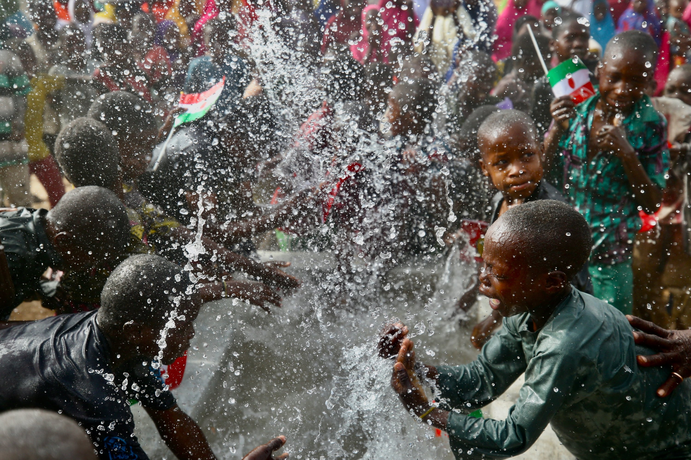

## **Tanzanian Water Wells Prediction**

## Business Understanding 

### Introduction

Tanzania is an East African country situated south of the Equator . Tanzania National Bureau of Statistics estimates a population of 61.8 million people. A publication done by World Bank approximates that only  61% of the population has acces to basic water supply , this has been made possible through programs such as the Water Sector Development Program. Since the commencement of the project, Tanzania has made significant progress towards access to water, sanitation and hygiene services, half the population now has access to clean water in the rainy season and two-thirds of the population during the dry season.

Despite the significant progress made, a considerable amount of the population still suffers from adverse effects of inadequate water supply and sanitation. Tanzania has had to contend  with death and disease as an immediate consequence of this with the burden falling heaviest on women, children, the poor and the vulnerable. 

### Problem Statement

>> The UN-Habitat wants to form a partnership with top funders in Tanzania who look to address sustainable development through ensuring clean water supply to communities in Tanzania. The UN-Habitat has taken keen notice on Tanzania’s commitment to expanding access to clean water over the past 7 years , however there is still an estimate of 31,000 deaths each year due to inadequate water and sanitation services. Over 10% of these deaths are preventable.

 >> An initiative is to be  set up to curb lack of acces to clean water supply  by looking into the distribution of wells in Tanzania and the functionality of water pumps in the existing water wells. Its’s worth noting that some water pumps are functional but in need of maintenance while others are simply non-functional. 

>> My task as a data scientist is to locate patterns that will enable me predict water pump functionality with the aim of providing insights on the core features that affect water pump functionality. These patterns will enable our stakeholders to accurately predict water pumps that need maintenance and water points that stakeholders should chanel their resources to due to them being non-functional.

### Challenges 

We will go ahead and explore some of the challenges being faced due to lack of access to clean water supply

1. Inadequate sanitation has greatly increased the rate of hospital acquired infections which in turn discourage patient’s from seeking care and result in increased mortality.

2. Water and Saniation services have also reduced the effectiveness of investments in education as disease and other heallth conditions result in cognitive deficits among childern which permanently impairs their capacity to learn. Many children who are physically present in school in Tanzania suffer from water and sanitation health related sicknesses and hunger which undermine their ability to learn.

3. At least six million working days are lost each year while the time required to reach distant water and sanitation facilities costs adults another 1.1 billion hours, for a total of over $1.4 billion in foregone income each year, or 1.9% of GDP. Lost labor hours and diminished productivity continually impinge on the government’s efforts to attract investment, encourage entrepreneurship, and raise living standards. 

### Objectives

1. To identify the patterns in functional and non-functional wells.

2. To predict the functionality of water pumps based on the features provided.

3. To ascertain features that greatly affect water pump functionality

### Evaluation Metrics

1. Generate a model with a True Positive Rate of 70%+

2. Root Mean Squared Error of close to 0 to evaluate model efficiency.

## Data Understanding 

The dataset for this project was generated from Driven Data. You can access it here [here](https://www.drivendata.org/competitions/7/pump-it-up-data-mining-the-water-table/)

The dataset contained 59,400 rows and 40 columns. Out of these columns 31 were found to be categorical and 9 to be numeric.We were able to narrow down the dataset to 52,560 observations and 19 columns after analysis. We only used 7 columns for our modelling. 

## Data Preparation

Data Preparation was done in two steps, we first started with cleaning our dataset then we cleaned the individual columns. We dropped the duplicated values . Visualized for outliers, there were outliers we simply could not decide to treat by just taking a look at the box plot so we decided to investigate them further through added visualizations and so no outliers were dropped at this stage .
We got the percentage of missing data in our dataset, dropped columns that contained high percentages but were not useful to use during modelling,  dropped rows of  columns with missing values but were needed during modelling. While looking into our columns we realized that some share in the same information and so we chose only one column that seem fit for our moddeling 

## Modelling 

Since our target variable had three categories we decided to to use classification algorithm to make predictions, we fitted two non parametric models : K-Nearest Neighbors and two ensemble models : Random Forest and Gradient Boosting. An increase in the True Positive Rate (Recall) percentage was observed as we continued fitting our model to get the desired metrics. We used Grid Search for the last model ; Gradient Boosting to check through the best parameters for our model. We also incorporated pipelines for readability and data leakage prevention.	

## Evaluation

We had set a recall of 70%+ for our model’s functionality once we deploy it to the public and a Root Mean Squared Error of close to 0 to test our model’s efficiency before the deployment, both of these metrics were met. The most important features are amount_tsh(water pump pressure) and qunatiy 

## Reccomendations and Conclusion

1. The UN-Habitat should partner with the government to ensure efficient pulling of funds such as to raise enough capital to push the initiative.

2. When the UN Habitat kicks the initiative they should look to contract DWE to do the water pump installations.

3. Features such as amount_tsh (water pump pressure ) and quantity of water are key indicators of water pump functionality, The organization should use these features to decide on whether a water pump is functional.

4. Lake Victoria has the most non functional wells yet its one of the largest water bodies in the region. The UN Habitat should perform an excursion on the region and check to see the resason why so and formulate a plan to solve that.

Its worth noting that most of the population does not stay around the wells, close to 2/3 of the population has access to water supply furthermore the country's urbanization rate has been increasing at a rate of 0.7 % per year , this brings up the assumption that maybe most people have adopted piped water as opposed to fetching water from wells . If the UN Habitat would also look into access to water supply in urban areas for their initiave in addition to fixing the water pumps then they would be making tremendous contribution towards their 2030 Agenda to  achieve their Sustainable Development Goals 

The model did well with continous training but with more and updated data I believe it can make better predictions and improve the performance of our model. This will also solve the imbalance we seem to have had on our dataset.

